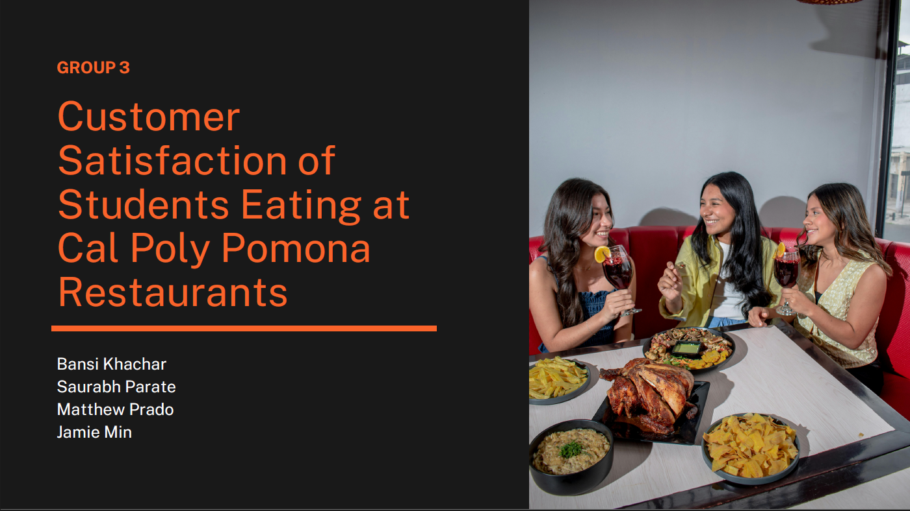
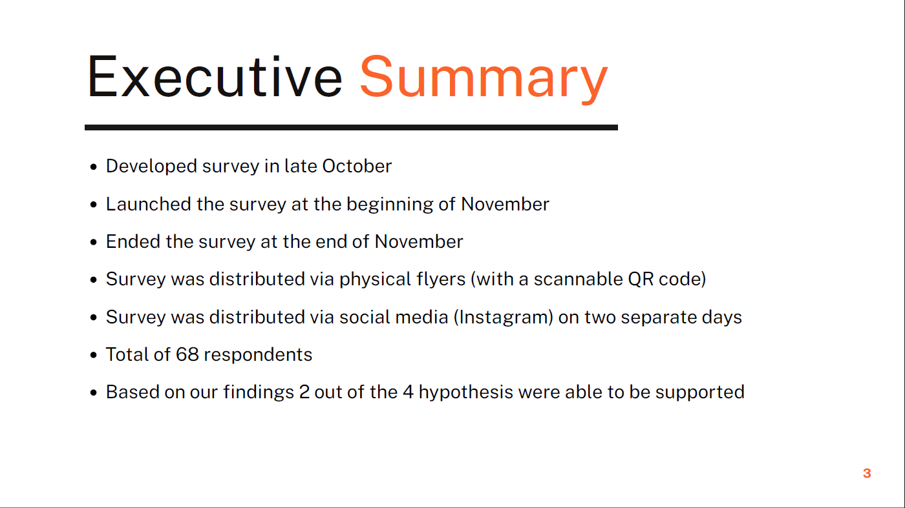
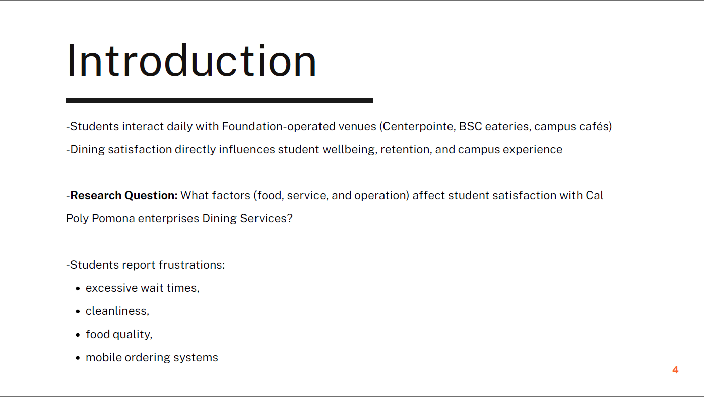
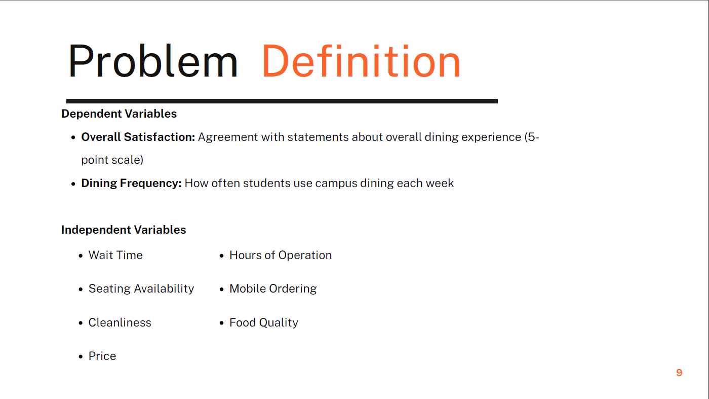
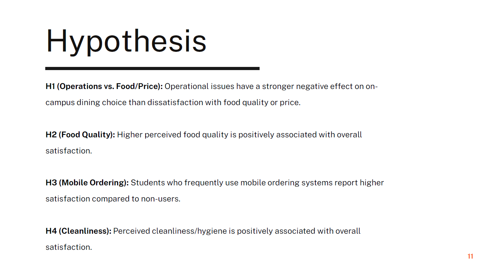
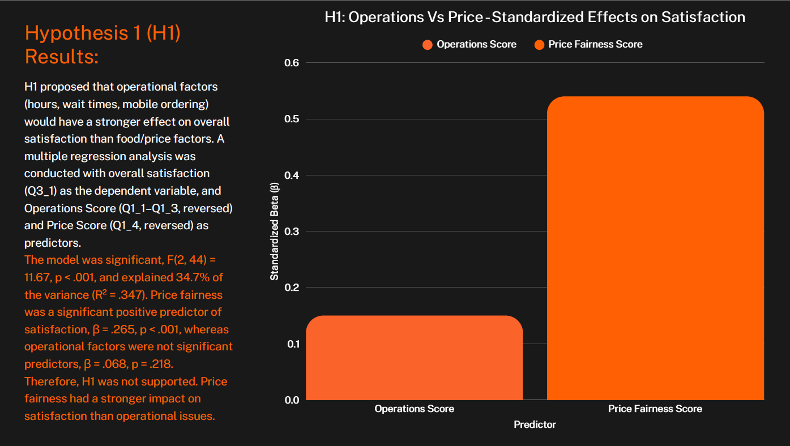
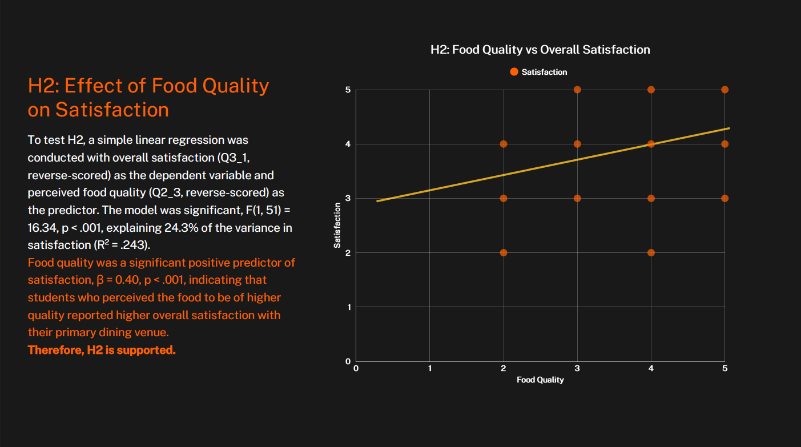
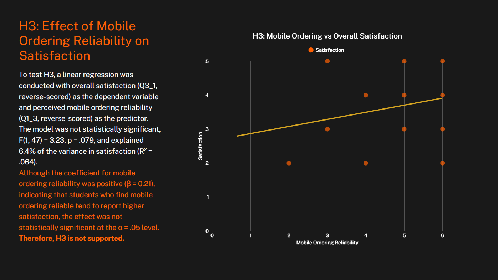
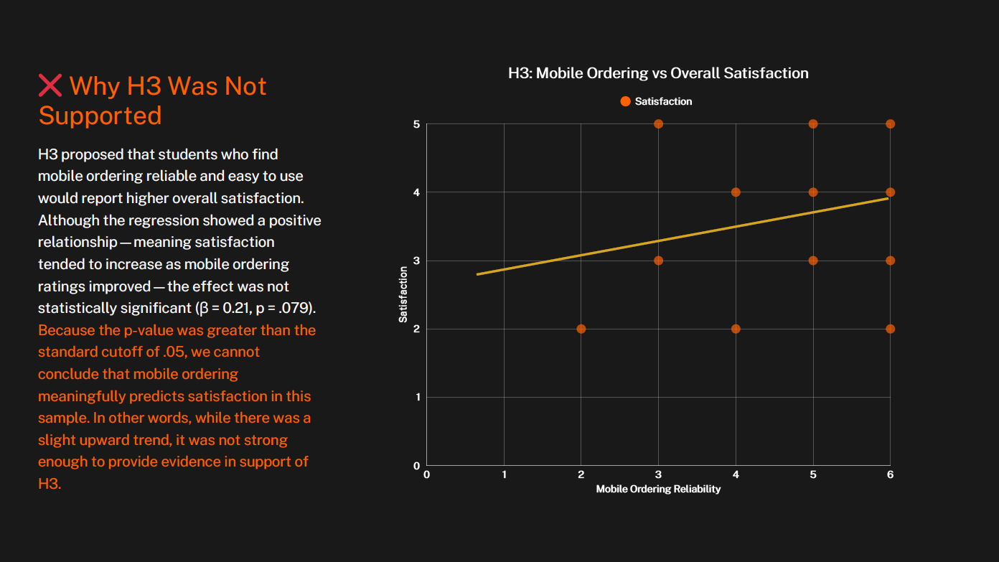
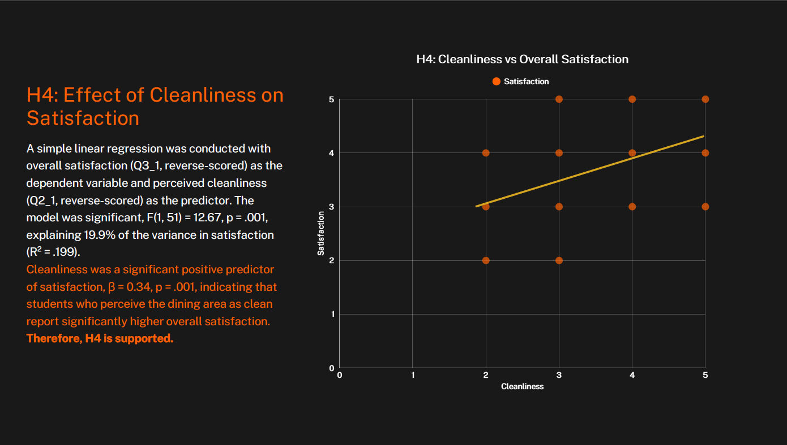

# Project 3: Customer Satisfaction of Students Eating at Cal Poly Pomona Restaurants

## Customer Insights + Data Analysis + Strategic Recommendations

### Project Overview

Conducted a survey to evaluate the customer satisfaction of students eating at Cal Poly Pomona restaurants. Analyzed the data to identify trends and areas for improvement in the dining experience.

### Research Process

Our research process involved designing a 17-question Qualtrics survey distributed via physical QR-codes flyers and INstagram across November. The survey caputred dining habits, venue experience, and satisfaction acros multiple dimensions using Likert scales, multiple choice, and net promoter score questions.

### Statisitcal Methods Applied:

- Descriptive Statistics: We calculated mean satisfaction scores, frequency distributions, and cross-tabulations to summarize the data and identify patterns in student dining preferences and satisfaction levels.
- Multiple & Simple Linear Regression: We used regression analysis to explore the relationships between various factors (e.g., food quality, service speed, menu variety) and overall student satisfaction, allowing us to identify key drivers of satisfaction and areas for improvement.
- Chi-Square Test: Examined whether campus presence frequency was related to satisfaction levels
- Cluster Segmentatiion: Grouped students into three distinct profiles based on dining behavior

### Key Findings

- Food quality and cleanliness were statiscally significant drivers of student satisfaction
- Price fairness had a stronger impact on satisfaction than operational factors, contray to the initial hypothesis
- Mobile ordering reliability showed a positive but statistically insignificant relationship with satisfaction
- Students were segmented into three distinct profiles: "Frequent Campus Diners," "Occasional Diners," and "Takeout-Focused Diners," each with unique preferences and satisfaction drivers
- Centerpointe Dining was the most visited venue on campus, followed by Panda Express and Starbucks

### Slides

|                         |                        |                        |
|-------------------------|------------------------|------------------------|
|   |  |  |
|   |  |  |
|   |  |  |
|  |                        |                        |