# Project 1: Trauma Resource Institute Analytics Project

## Google Analytics + SEO + User Engagement Strategy + Mobile App

### Project Overview

Analyzed website engagement and acquisition performance for Trauma Resource Institute using Google Analytics, Google Tag Manager, and Square Space data. As well as focus on recommendations for mobile app

### Responsibiillities

- Evaluated user acquisition channels
- Analyzed engagement behavior
- Identified SEO opportunities
- Developed strategic recommendations

### Key Findings

- Organic Search was the highest-perofroming traffic soruce
- Training pages showed strongest engagement
- Paid search and social channels showed growoth opportunities
- Recommendations focused on conversion optimization and retnention strategies

### Outcome

Created strategic recommendations for improving conversions, SEO performance, and user engagement.

### Slides

|                         |                         |                        |
|-------------------------|-------------------------|------------------------|
| 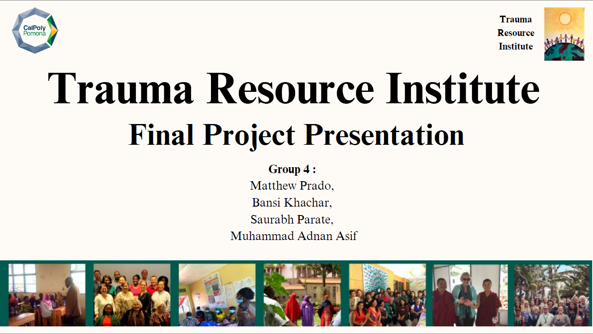  | 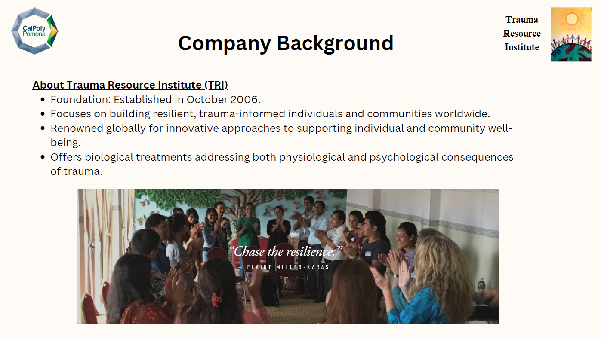  | 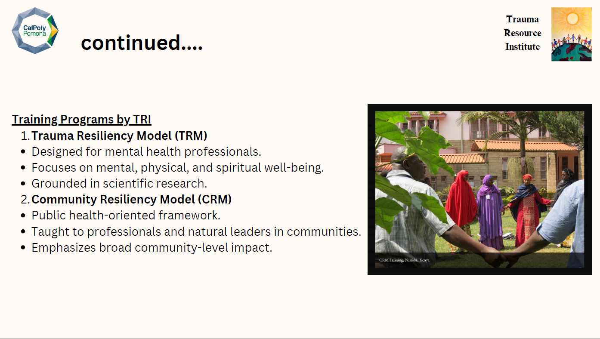 |
| 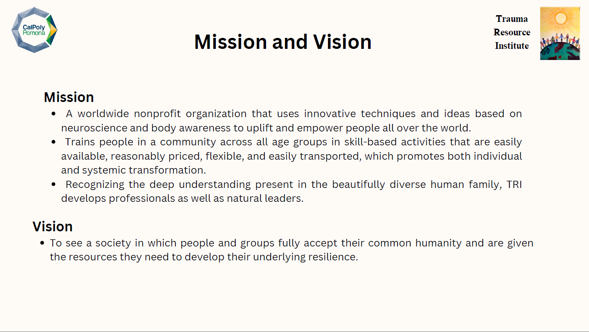  | 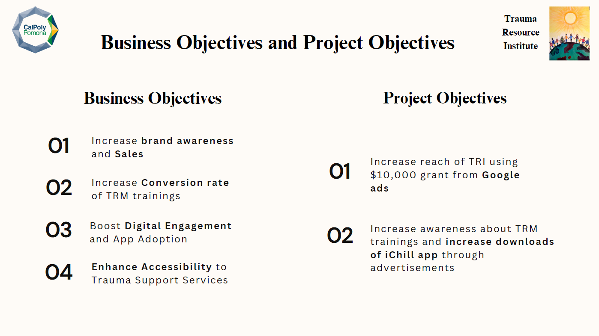  | 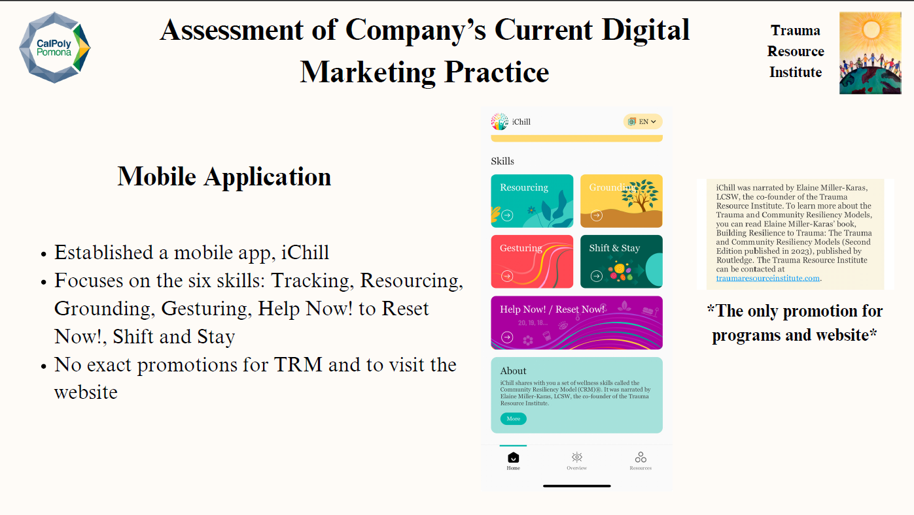 |
| 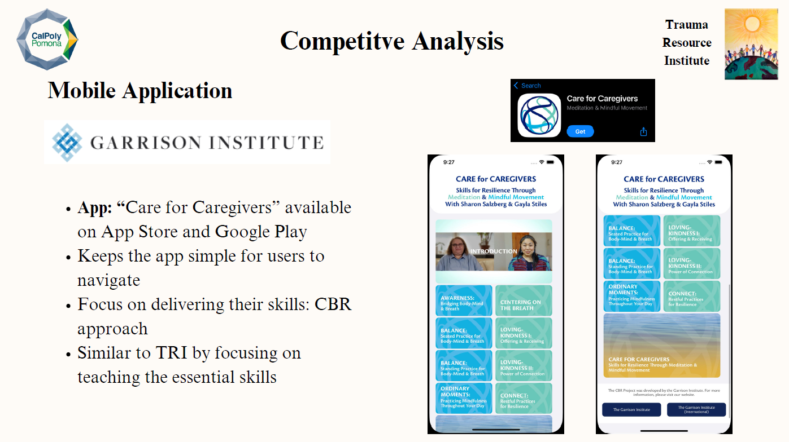  | 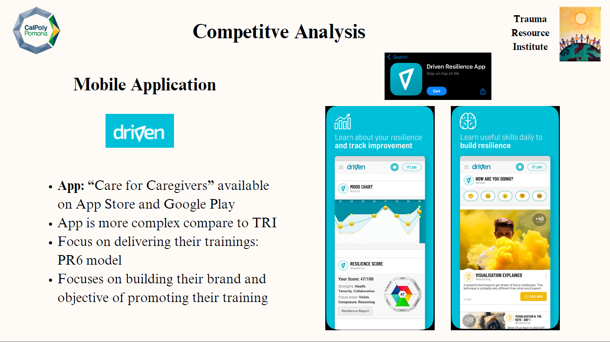  | 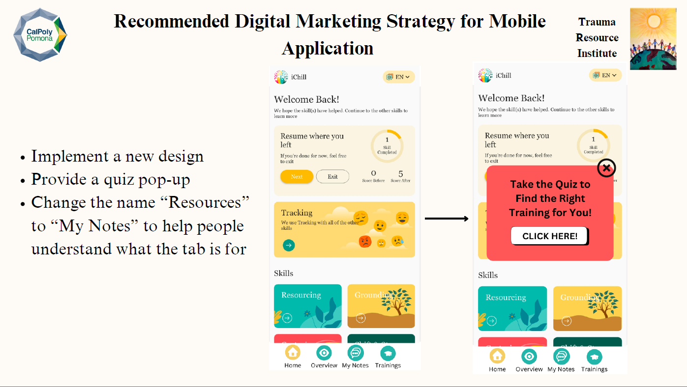 |
| 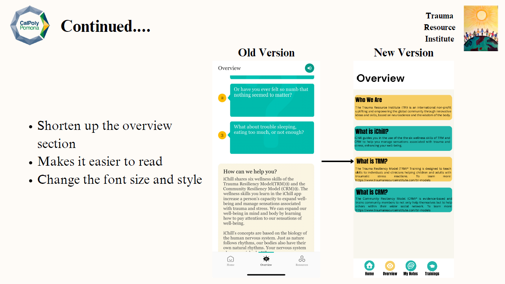 | 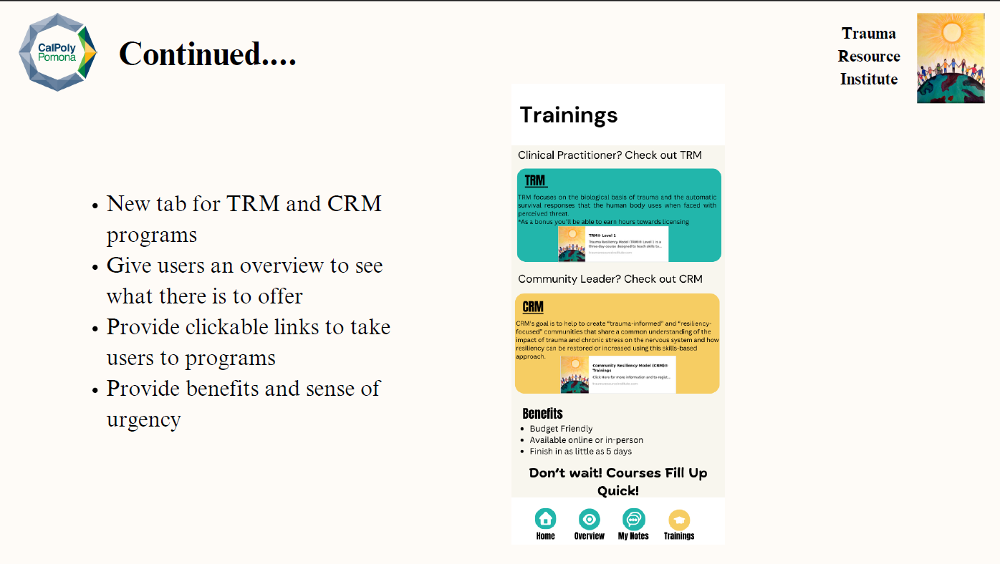 |                        |

# Project 2: Trauma Resource Institute Marketing Strategy Project

## Google Ads + Competitve Analysis + Customer Segmentation + Growth Strategy

### Project Overview

Developed a strategic digital marketing plan focused on increasing brand awareness, TRM/CRM program visibility, and enhancing engagement through Google Ads and mobile app optimization.

### Problem/Objective

The project aimed to address low brand awareness and engagement for the Trauma Resource Institute's TRM/CRM programs, with a focus on leveraging digital channels to reach target audiences effectively.

The project focused on: - increasing awareness of TRM an CRM trainng programs - improving digital engagement - evaluating website performance - and idenitfying scalable marketing opportunities

### Responsibilities

- Customer Analysis
- Competitive Analysis
- Mobile App Evaluation
- Strategic Recommendations

### Key Findings

- Organic search and direct traffic dominated, accounting for nearly all user acquisition
- TRM-related pages had significantly above-average engagement time
- Email and paid search were severely unerperforming relative to industry benchmarks
- Retention rate stood at 27.7%
- High-impression keywords like "resiliency" and "trauma training" had 0% click-through rates

### Slides

|                        |                        |                        |
|------------------------|------------------------|------------------------|
| 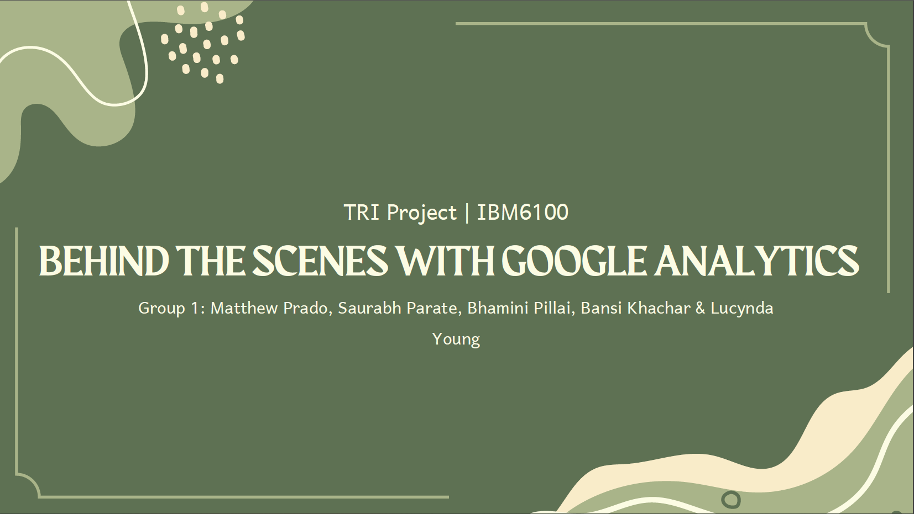 | 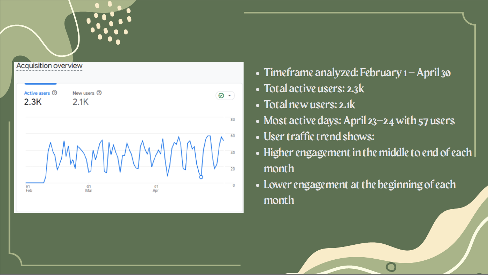 | 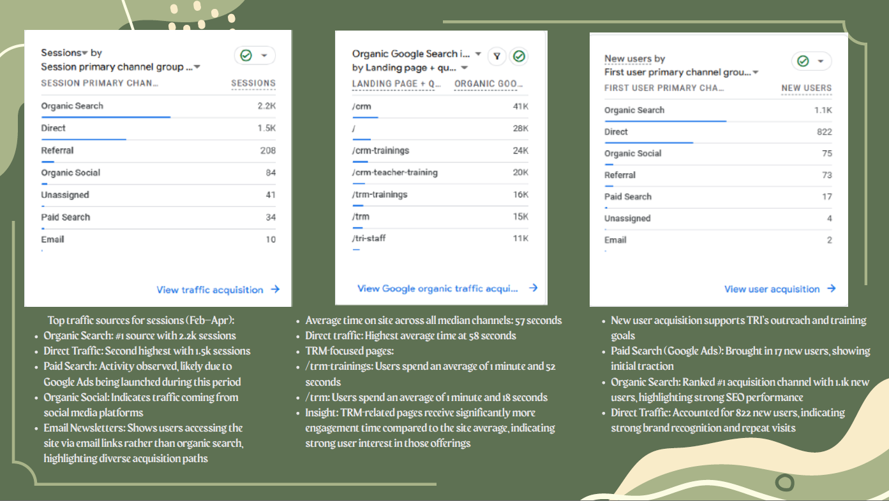 |
| 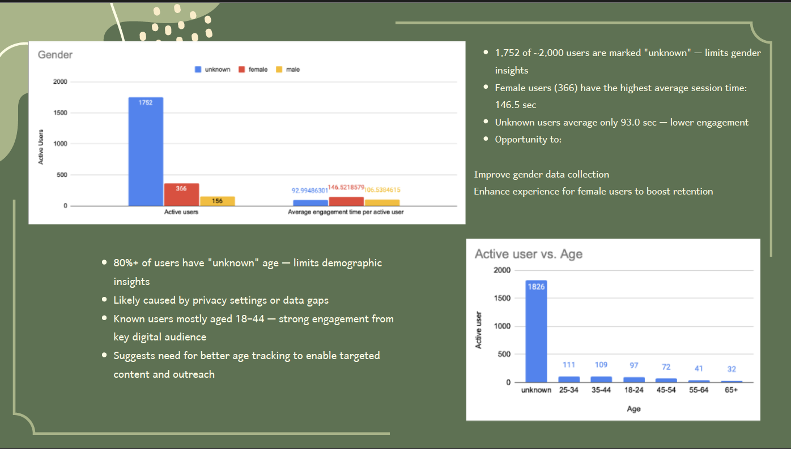 | 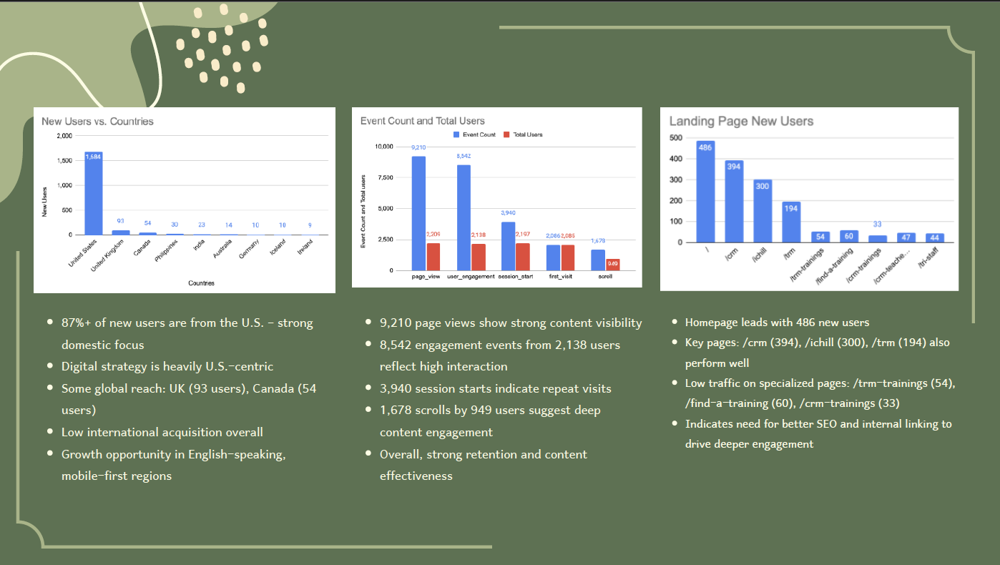 | 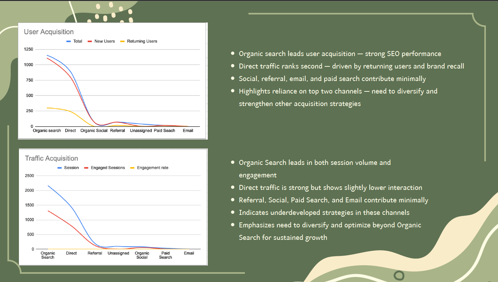 |